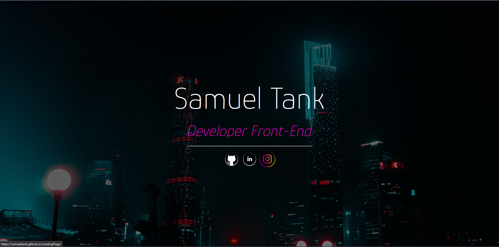

# Landing Page
primeira website criado, com fins diadaticos, para o curso de desenvolvimento de sistema do [senai jandira](https://jandira.sp.senai.br/), com orientação do professor [Fernando leonid](https://github.com/FernandoLeonid).
## O que é uma Landing Page?
são paginas com foco principal de conversão de conversão dos visitante. Assim, essas paginas de conversão possuem poucos elementos comparados com paginas tradicionais, evitando distrações, evitando distrações e garantindo o objetivo.
## Web Page
o site pode ser acessado pelo link: https://samueltank.github.io/LandingPage/

[Samuel Tank](https://github.com/samueltank)
## Tecnológia
* HTMS
* CSS
* VScode

## Screenshot

