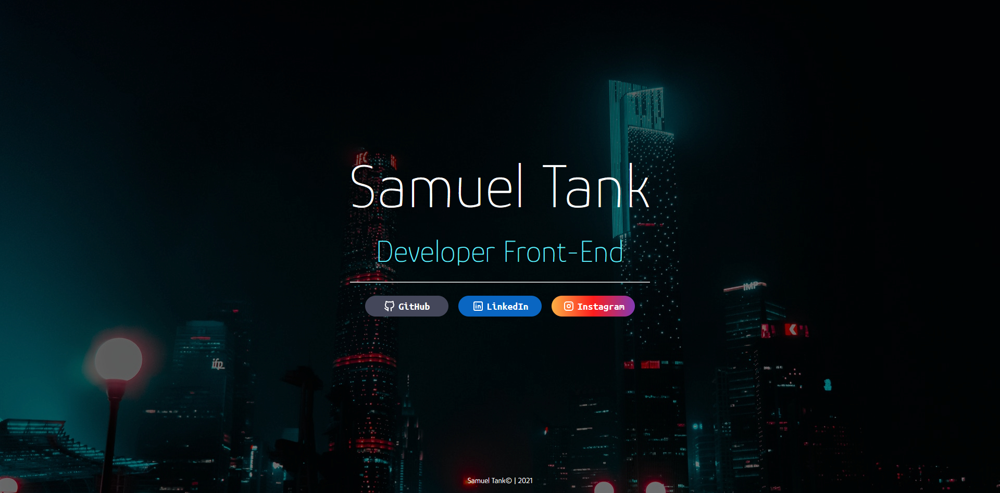

# Landing Page
Website criado, para fins didáticos do curso de desenvolvimento de sistemas, do [SENAI jandira](https://jandira.sp.senai.br/), com orientação do professor [Fernando Leonid](https://github.com/FernandoLeonid).

## O que é uma Landing Page?
É uma página com foco principal em "capturar" visitantes. Assim, essa página de conversão possui poucos elementos comparados com páginas tradicionais, evitando distrações e garantindo o objetivo.

## Acesso à Web Page
A web page pode ser acessada pelo link: https://samueltank.github.io/LandingPage/

[Samuel Tank](https://github.com/samueltank)
## Técnologias utilizadas
* HTMS
* CSS
* VScode

## Screenshot

